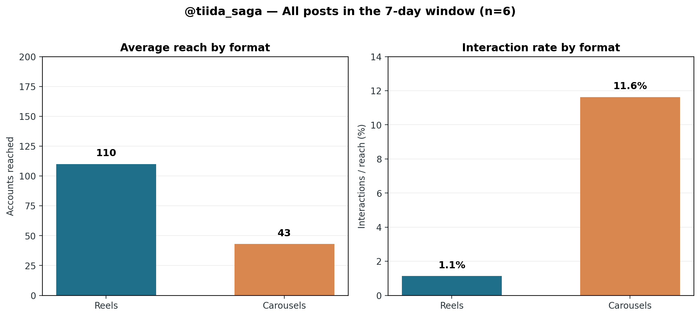

# Instagram競合・自社分析レポート

**対象期間：2026年7月11日 00:00 UTC〜2026年7月18日 00:00 UTC**
**分析対象：競合9アカウントおよび @tiida_saga**
**作成日：2026年7月18日 UTC**

> 本レポートは、公開プロフィール・公開投稿本文と自社のInstagram Business Insightsを突合して作成したものです。競合の保存数、シェア数、リーチ、インプレッションは非公開であり、ログイン制約によって一部の投稿本文、公開いいね数、コメント数、ハッシュタグを取得できませんでした。取得できない箇所は **「未確認」** と表記し、推定値や創作した数値は記載していません。なお、投稿後間もない自社投稿は数値が今後変動します。

## エグゼクティブサマリー

競合の公開情報からは、**地域性、施工・素材の具体性、暮らしの情景、そして相談・見学会への導線**を一つのアカウント体験として接続する運用が優位であることが分かりました。特に木ここち建築工房は、地域材・職人・自然・家族の暮らしを一貫した物語にしています。イノウエハウジングは、施工事例を「外壁」「木格子」「和室」「収納」のような単位に分解し、高頻度で発信しています。プレースホームは見学会、資料請求、質問箱、リフォームなどのハイライトで、投稿閲覧後の行動導線を整備しています。[1] [3] [6] [9]

自社の対象期間の投稿は、**リール4件、カルーセル2件の計6件**でした。リールは投稿別リーチの平均が110、カルーセルは43であり、リールが認知拡大に向きます。一方、総インタラクションを投稿別リーチの合計で割った反応率は、リール1.13%に対してカルーセル11.63%でした。小標本かつ投稿経過時間が異なるため因果は断定できませんが、**「リールで新規到達を取り、カルーセルで保存・相談意向を深める」役割分担**は次週も検証価値があります。[13]

来週は、投稿数を増やすこと自体よりも、**①リールで施工の変化を一目で見せる、②カルーセルで検討時に保存したくなる判断材料を渡す、③ストーリーズで現場の人・質問・相談導線をつなぐ**という三層構成を推奨します。主戦場を「佐賀・鳥栖・基山・みやき町周辺の水回り・住まいの困りごとを抱えるリフォーム検討層」に明確化し、住宅リフォームと直接結び付かない発信は原則として別アカウントまたはストーリーズで扱います。

| 優先順位 | 次週の実行方針 | ねらい | 判定KPI（運用目標、予測値ではない） |
|---|---|---|---|
| 1 | 保存前提のカルーセルを1件 | 検討者に「後で見返す理由」を渡す | 保存3件以上、DM相談1件以上 |
| 2 | ビフォーアフター型リールを1件 | 一目で変化を見せ、到達を広げる | リーチ200以上、完了視聴率を記録 |
| 3 | 投票・質問つきストーリーズを3コマ以上 | 接点と相談のきっかけを増やす | 投票15件以上、返信・DMを合計3件以上 |
| 4 | 投稿後24時間の反応確認 | 次回改善を速く回す | 保存、シェア、プロフィール遷移、DMを記録 |

## 1. 調査方法と留意点

公開プロフィールと公開投稿ページから、フォロワー数、投稿数、直近の投稿日、投稿形式、本文、公開いいね数、公開コメント数、ハッシュタグを確認しました。自社については、Instagram Business Accountのアカウント情報、投稿一覧、投稿別Insightsを2026年7月18日UTCに取得しています。[13]

本期間はUTCで集計しているため、日本時間では概ね2026年7月11日09:00〜7月18日09:00に相当します。競合のフォロワー数は取得時点のスナップショットであり、比較対象としてはプロフィール規模を見るために用います。**リーチや保存数が不明な競合を、いいね数だけで「成果が高い・低い」と結論付けない**ことを原則とします。

> **表記ルール**：`未確認` はログイン制約または公開ページの情報不足により確認できなかった項目です。`0` は公開ページまたは自社Insightsでゼロが確認できた項目です。両者を混同しません。

## 2. 競合アカウントの直近1週間スナップショット

| アカウント | 公開プロフィール規模 | 対象期間に確認できた直近投稿・内容 | 公開反応数 | 使用ハッシュタグ／内容上の特徴 | 比較上の示唆 |
|---|---:|---|---|---|---|
| **@kicocochi_kobo** | 2,985 followers、385 posts | 「やどり木」体験型ショールーム、地域材・焼杉、造作建具、珪藻土、八女杉、社員旅行、川辺の家など。関連ブランドの7/16投稿では伝統工法「三角焼き」を職人技と地域材の物語として発信。 | 関連ブランド投稿で55いいね・2コメントを確認。指定アカウントの投稿別数値は未確認。 | `#木ここち建築工房 #八女市星野村の工務店 #自然素材の家 #八女杉 #焼杉の家 #造作建具` 等。素材をスペックで終わらせず、暮らし・風景・手仕事に接続。 | **地域性×職人×暮らし**の一貫した世界観。自社でも「施工箇所→暮らしの困りごと→解決」の物語化を徹底する。 [1] [2] |
| **@placehome** | 3,227 followers、1,781 posts | 7/11〜7/14にリール・写真・リールの掲載を確認。公開プロフィールでは見学会、お客様の声、来場予約、資料請求、質問箱、リフォーム等のハイライトを整備。 | 個別投稿の公開いいね・コメントは未確認。 | 個別ハッシュタグは未確認。体験館PLUS、佐賀・福岡・東京、新築・リノベ、エクステリアを明示。 | 投稿単体ではなく、**見学・資料請求・質問への導線**を常設している。自社も「DM相談」「施工事例」「相談前の判断材料」をストーリーとハイライトで接続する。 [3] |
| **@eda_kensetsu** | 1,377 followers、395 posts | 個別投稿の対象期間データは未確認。プロフィールは佐賀・鳥栖の新築・リフォーム、健康住宅、自然素材、長期居住の「住医」を訴求。 | 未確認 | 未確認。ブランドメッセージでは健康・自然素材・長く住める家を明確化。 | ティーダは「住まいの不具合を診る専門家」という位置づけを、屋根・水回り・補助金・中古住宅リノベの具体策で可視化すると差別化しやすい。 [4] |
| **@irodori8223** | 704 followers、1,527 posts | 個別投稿の対象期間データは未確認。公開プロフィール名は株式会社 彩。 | 未確認 | 未確認 | 投稿総数が多く、継続運用の蓄積がある。自社は量で追随するより、地域リフォームの意思決定を助ける検索性・保存性で勝つ。 [5] |
| **@torikaihome** | 未確認 | 公開ページがログイン画面となり、対象期間の投稿を確認できず。検索結果のみで投稿者を確定しないため、第三者投稿は採用していない。 | 未確認 | 未確認 | **推定を排除**する。次回、ログイン済み環境で投稿本数・上位投稿・タグを再確認する。 [12] |
| **@inouehousing** | 991 followers、投稿数未確認 | 7/12リール「ガレージから始まる、快適で賢い平屋暮らし」、7/14・7/16写真「いくつもの表情をもつ家」。塗り壁・サイディング・木格子・和室・収納など、1施工事例を細部ごとに訴求。 | 7/12リール：19いいね・0コメント。7/14写真：20いいね・0コメント。7/16写真：16いいね・0コメント。 | 施工事例では `#新築工事 #注文住宅 #塗り壁 #サイディング #飾り棚 #和室 #木格子`。リールでは `#平屋 #ビルトインガレージ #エコな住まい`。 | 施工事例を「箇所」「悩み」「効果」に分解する連載型。自社の水回り施工も、浴室・洗面・収納・動線・清掃性に切り分けて再利用できる。 [6] [7] [8] |
| **@rokka_staff** | 468 followers、投稿数未確認 | 7/11に写真投稿を確認。プロフィールは地元の木を使った高性能住宅、最新情報はストーリーズで更新する方針。直近には事務所移転告知も掲載。 | 未確認 | 個別ハッシュタグは未確認。水田分譲地、蒲原分譲地、企画住宅のハイライト。 | フィードをすべて施工写真にせず、**ストーリーズを最新情報の受け皿**にしている。自社も現場速報・小さなQ&Aはストーリーズで高頻度に扱う。 [9] |
| **@hooop.inc** | 1,411 followers、1,240 posts | 直近個別投稿の一覧は未確認。プロフィールで新築・リノベ・店舗改装・外構を横断し、社長の日常はストーリーズで発信と明示。 | 未確認 | 個別ハッシュタグは未確認。佐賀・福岡の地域性を明示。 | 専門領域を横断する場合でも、**人（社長・職人）の顔をストーリーズに置く**設計。自社も代表・職人・現場監督の見解を15秒で伝え、親近感を補完する。 [10] |
| **@eternal_designlife** | 600 followers、投稿数未確認 | 公開一覧で確認できる最新投稿日は2025/4/3であり、対象期間の投稿は確認できない。プロフィールは唐津市の平屋、デザイン性、省エネ、耐震、プライバシー、中庭、家事動線を訴求。 | 対象期間は該当なし／未確認 | 対象期間のハッシュタグは未確認。 | 投稿頻度の低い競合に対し、自社は**定期性と相談導線**で想起を獲得できる。頻度は目的に沿わせ、単なる連投にはしない。 [11] |

### 競合から抽出した実践パターン

| パターン | 競合で確認した例 | 自社への転用 |
|---|---|---|
| **素材・技術を暮らしへ翻訳する** | 木ここちは八女杉、焼杉、左官、造作を「地域・職人・家族の豊かさ」に接続している。 | 「浴室断熱」「収納」「段差解消」を、性能説明だけで終えず「冬の入浴」「朝の支度」「将来の安心」の情景まで書く。 |
| **1施工を複数テーマに分解する** | イノウエハウジングは、外壁、木格子、和室、収納などを別々の見どころにしている。 | 1現場から「不具合」「施工中」「完成」「使い勝手」「費用・工期の考え方」の5本を設計する。 |
| **フィード後の行動を設計する** | プレースホームは見学会、声、予約、資料請求、質問箱をハイライトで整備している。 | プロフィール上部に「施工事例」「リフォームの流れ」「補助金」「DM相談」のハイライトを設置し、各投稿のCTAを一つに絞る。 |
| **日常性はストーリーズで補う** | ROKKAとHOOOPは、最新情報・社長の日常をストーリーズに置く方針を明示。 | 現場の進捗、素材選定、職人の一言、投票をストーリーズに集約し、フィードの専門性を希薄化させない。 |

## 3. 自社 @tiida_saga の直近パフォーマンス

### 3.1 アカウントの現状

自社アカウントは、フォロワー548、フォロー1,556、投稿266件です。訴求領域は、佐賀県のみやき町、鳥栖市、基山町、神埼市、吉野ヶ里町、佐賀市などにおけるリフォーム・リノベーション、補助金活用、水回り・内装・外壁・屋根、中古住宅購入＋リノベです。[13]

競合の公開フォロワー規模と比較すると、自社はプレースホーム（3,227）、木ここち（2,985）、HOOOP（1,411）、江田建設（1,377）、イノウエハウジング（991）より小規模です。一方で、競合規模の大きさをそのまま追うのではなく、**「佐賀近郊でリフォームを検討する人が、判断に迷ったときに保存・DMしたくなるアカウント」**として、地域性と課題解決の解像度を高めることが優先です。[1] [3] [4] [6] [10]

### 3.2 投稿別の詳細指標

| 投稿日UTC | 形式 | 主題 | リーチ | 再生数 | いいね | コメント | 保存 | シェア | 総インタラクション |
|---|---|---|---:|---:|---:|---:|---:|---:|---:|
| 7/17 | リール | 屋根の状態確認・メンテナンス | 73 | 93 | 0 | 0 | 0 | 0 | 0 |
| 7/17 | リール | 4児の父・AI活用・働き方 | 23 | 45 | 1 | 0 | 0 | 0 | 1 |
| 7/16 | リール | 浴室の使い勝手確認・DM相談 | 165 | 216 | 0 | 0 | 0 | 0 | 0 |
| 7/15 | カルーセル | 水回りリフォームの困りごと整理・保存訴求 | 42 | 105 | 4 | 0 | 0 | 0 | 4 |
| 7/13 | カルーセル | 水回りリフォームで「やってよかった」3工夫 | 44 | 144 | 5 | 0 | 1 | 0 | 6 |
| 7/12 | リール | 浴室・トイレの改善事例／DM相談 | 179 | 227 | 4 | 0 | 0 | 0 | 4 |

*出典：自社Instagram Business Insights。リーチと再生数は投稿別の数値であり、期間合計は同一利用者の重複を含む可能性があります。[13]*

期間合計では、投稿別リーチの合計は526、再生数の合計は830、いいねは14、保存は1、シェアは0、総インタラクションは15でした。新しい2本のリールは取得時点で投稿直後であるため、次週の意思決定では24時間後・72時間後・7日後の経過も併記する必要があります。

### 3.3 形式別の読み解き

| 観点 | リール（4件） | カルーセル（2件） | 次週の運用判断 |
|---|---:|---:|---|
| 投稿別リーチの合計 | 440 | 86 | リールを認知拡大の主軸にする。 |
| 平均リーチ | 110 | 43 | リールは冒頭3秒の「変化」または「不安」を強く見せる。 |
| 総インタラクション | 5 | 10 | カルーセルは保存・相談意向を高める役割を持たせる。 |
| 到達あたり総インタラクション | 1.13% | 11.63% | カルーセルには「保存する理由」と、末尾の具体的CTAを必ず置く。 |
| 保存数 | 0 | 1 | 保存設計は弱い。チェックリスト、NG集、費用・工期の判断軸を中心にする。 |

この差は投稿形式のみで生じたものとは結論付けられません。テーマ、投稿経過時間、クリエイティブ、フォロワーへの表示条件が異なるためです。ただし、7/13の「やってよかった3工夫」は、同期間に唯一保存を獲得しており、**箇条書きで持ち帰れるノウハウ**が保存導線として有望であることを示します。[13]

リールでは、7/12の「浴室・トイレの改善事例」が対象期間内で最大のリーチ179・再生227を記録しました。次週のリールは、浴室リフォームのビフォーアフターを最初の3秒に置き、視聴者が「自分の家にも当てはまる」と感じる問題を一文で提示します。AI活用・働き方の投稿は、住宅リフォームの主ターゲットと異なるうえ評価時点のリーチも23と低いので、今後は本アカウントでは**現場・住まい・相談の文脈に接続できる場合のみ**扱い、その他は別媒体で発信することを推奨します。[13]

## 4. 来週の投稿戦略（2026年7月20日〜7月26日）

### 4.1 週間スケジュール

| 日時（JST） | 形式 | テーマ | 役割 | 主CTA | 準備素材 |
|---|---|---|---|---|---|
| 7/20（月）19:30 | カルーセル（10枚） | 水回りリフォームで後悔しない「やってはいけない」3つ | 保存・専門性 | 「保存して打合せ前に見返す」「DMで相談」 | 実例写真3〜4枚、清掃・収納・コンセントの図解 |
| 7/22（水）12:00 | ストーリーズ（3コマ＋投票） | 現場のリアルと浴室オプション投票 | 親近感・質問収集 | 「投票する」「質問箱へ送る」 | 現場動画、施工前写真、完成写真 |
| 7/24（金）19:30 | リール（20〜25秒） | 築年数を重ねた浴室の劇的ビフォーアフター | 新規到達・信頼 | 「プロフィールから施工事例を見る」「DMで相談」 | Before、解体、施工中、After、職人の手元 |
| 7/25（土）10:00 | ストーリーズ（2コマ） | リールの補足Q&A「費用・工期で一番聞かれること」 | 相談導線 | 質問スタンプ | リールの切り抜き、回答テキスト |

### 4.2 カルーセル案：保存を生む「後悔回避」投稿

**投稿テーマ**：**【保存版】水回りリフォームで後悔しない。プロが教える「やってはいけない」3つ**

競合が施工事例の美しさや素材を細分化して見せていることを参考にしつつ、自社は「検討者が打合せ前に役立てられる判断軸」を提供します。表紙のフックは不安に寄せ、2〜8枚目で具体策を伝え、9〜10枚目で相談導線へ着地させます。

| スライド | 見出し | 本文・ビジュアル指示 |
|---:|---|---|
| 1 | 【保存版】水回りリフォームで後悔しない3つのこと | 施工前・施工後を薄く背景にし、文字は大きく。`後悔` と `3つ` を強調。 |
| 2 | きれいになったのに、使いにくい…を防ぐ | 「見た目だけで決めると、毎日の小さな不満が残ります」と共感を置く。 |
| 3 | NG 1：収納を後回しにする | 洗面台周りのストック品が溢れる写真またはイラスト。 |
| 4 | 解決：使う場所に、使う量だけ収納 | タオル、洗剤、ドライヤー等を分類。「今の収納を写真で撮る」行動を提案。 |
| 5 | NG 2：掃除のしやすさを確認しない | 水垢・目地・凹凸をイメージする写真。煽りすぎない。 |
| 6 | 解決：素材・目地・水切れを比較する | 「ショールームで確認する3点」をチェックリストで示す。 |
| 7 | NG 3：コンセントの位置を決めずに進める | ドライヤー、電動歯ブラシ、ヒーターのアイコン。 |
| 8 | 解決：朝と夜の動きを想像する | 「誰が、いつ、何を使うか」を家族で書き出す提案。 |
| 9 | ティーダは“使い始めてから”を考えます | 現場の写真に「収納・清掃・動線まで一緒に整理」の短文。 |
| 10 | 保存＋DM相談 | 「リフォーム前の打合せに保存」「お悩みはDMでどうぞ」の二つだけを明記。 |

**キャプション案**

> 【保存版】水回りリフォームで後悔しないための3つのポイント。
>
> 「きれいになったのに、なんだか使いにくい…」
> 水回りは毎日使う場所だからこそ、見た目だけで決めると小さな不満が残りやすい場所です。
>
> 今回は、現場でよく聞く後悔をもとに、打合せ前に確認したい3つをまとめました。
> これから浴室・洗面・トイレのリフォームを考える方は、右上から保存しておいてください。
>
> 佐賀・鳥栖・基山・みやき町周辺のリフォーム相談はDMで受け付けています。

**推奨ハッシュタグ（22個）**：

`#佐賀リフォーム #佐賀工務店 #鳥栖市リフォーム #基山町リフォーム #みやき町リフォーム #水回りリフォーム #洗面所リフォーム #浴室リフォーム #お風呂リフォーム #トイレリフォーム #リフォーム計画 #リフォームの失敗 #後悔しない家づくり #戸建てリフォーム #中古住宅リノベ #住まいの悩み #収納アイデア #掃除しやすい家 #ヒートショック対策 #リフォーム相談 #ティーダ建築工房 #佐賀県`

### 4.3 リール案：一目で変化を伝えるビフォーアフター

**投稿テーマ**：**築〇年の浴室が、ホテルのように整うまで｜20秒ビフォーアフター**

木ここち建築工房が職人・素材・暮らしを一続きで語る構成を参考に、自社はリフォームの価値である「変化」と「使い始めた後の安心」を短尺で示します。単なる完成写真ではなく、施工プロセスの一瞬と職人の手元を挟み、信頼の根拠を見せます。[1] [2]

| 時間 | 画面・テロップ | 演出意図 |
|---|---|---|
| 0〜3秒 | BeforeとAfterを左右に並べる。テロップ「冬、寒いお風呂。変えたのは見た目だけではありません」 | 悩みと変化を同時に提示し、スクロールを止める。 |
| 3〜7秒 | 古い設備の解体、下地確認の手元。テロップ「見えない部分も、現場で確認」 | 施工品質と専門性を示す。 |
| 7〜12秒 | ユニットバス施工、職人の手元。テロップ「毎日使うから、掃除・温かさ・動線まで」 | 完成前の価値を伝える。 |
| 12〜19秒 | Afterをゆっくりパン。床、手すり、棚、照明を各1秒程度。 | 視覚的満足と具体的ベネフィット。 |
| 19〜24秒 | テロップ「佐賀の浴室リフォーム、まずは今の困りごとから整理しませんか？」＋ロゴ | DM相談への自然な着地。 |

**キャプション案**

> 築〇年のお風呂が、毎日の疲れをほどく場所へ。
>
> 「冬は足元が冷たい」「掃除が大変」「出入りが不安」——浴室のお悩みは、家族によって違います。
> 今回は、施工前から完成までを短くまとめました。見た目を整えるだけでなく、毎日使い続けることを考えて、清掃性・温かさ・使いやすさを一緒に整理します。
>
> お風呂の今の状態に不安がある方は、DMで写真を送ってご相談ください。佐賀・鳥栖・基山・みやき町周辺で対応しています。

**推奨ハッシュタグ（21個）**：

`#佐賀リフォーム #佐賀工務店 #鳥栖市リフォーム #基山町リフォーム #みやき町リフォーム #浴室リフォーム #お風呂リフォーム #ユニットバス #水回りリフォーム #ビフォーアフター #リフォーム事例 #戸建てリフォーム #バリアフリーリフォーム #ヒートショック対策 #省エネリフォーム #住まいの悩み #職人の仕事 #リフォーム相談 #ティーダ建築工房 #佐賀県 #福岡リフォーム`

### 4.4 ストーリーズ案：現場・投票・相談をつなぐ3コマ

**投稿テーマ**：**現場のリアル＋「浴室で一番ほしいオプション」投票**

ストーリーズは、フィードで扱う専門テーマを薄めずに、人柄と即時性を補う場所として運用します。現場動画、アンケート、回答・質問導線を連続させ、最後にリンクまたはDMへ着地させます。

| コマ | 画面 | 掲載文 | インタラクション |
|---:|---|---|---|
| 1 | 現場で作業する職人の後ろ姿、または資材のアップ | 「本日は〇〇市の浴室リフォーム現場へ。完成後には見えなくなる部分も丁寧に確認しています。」 | 温度・天気スタンプのみ。 |
| 2 | 施工前写真またはイメージ素材 | 「浴室リフォームで一番ほしいのはどれですか？」 | 投票：`浴室暖房乾燥機`／`お掃除しやすい床`。必要なら3択クイズ形式。 |
| 3 | 完成後の床・換気・収納の写真 | 「結果は明日共有します。ご自宅で気になることは質問箱へどうぞ。」 | 質問スタンプ：「お風呂・洗面の困りごとを教えてください」。 |

翌日、投票結果を1枚で共有し、回答に合わせてカルーセルまたはリールを再シェアします。投稿の再利用は、同じ主題を別の行動に変換するためであり、単なる告知の繰り返しにはしません。

## 5. 運用ルールと次回分析への引継ぎ

次週は、公開いいね数だけでなく、自社Insightsの**リーチ、再生数、保存、シェア、プロフィールアクション、DM件数**を投稿後24時間・72時間・7日で記録してください。保存やDMが少ない場合は、テーマを変える前に、表紙のフック、スライド2枚目の共感、最後のCTAのいずれが弱かったかを順番に検証します。

| 確認タイミング | 記録項目 | 改善判断 |
|---|---|---|
| 投稿後24時間 | リーチ、再生数、保存、シェア、コメント、DM | 反応が弱ければストーリーズで「保存しましたか？」ではなく、投稿内の具体論を1点再提示する。 |
| 投稿後72時間 | プロフィール遷移、フォロー、DM内容 | 質問が多い論点を次のカルーセルの見出しに転用する。 |
| 投稿後7日 | 投稿別のリーチ、保存率、DM、商談化 | 同じ現場を「困りごと」「工事」「完成」「費用・工期」「お客様の声」に分解して再活用する。 |

競合調査は、次回はログイン済み環境で各アカウントの直近投稿URL、いいね数、コメント数、投稿形式、ハッシュタグを再取得し、**投稿数で正規化した公開エンゲージメント**を補完してください。今回のように情報取得に制約がある場合は、取得できた数字だけで強弱を断言せず、クリエイティブ構造・導線・投稿の役割分担に焦点を当てることが再現性のある分析につながります。

## 参考資料

[1]: https://www.instagram.com/kicocochi_kobo/ "木ここち建築工房 Instagramプロフィール"
[2]: https://www.instagram.com/reel/DazmIxkBm4Y/ "HUIZEN / 木ここち建築工房関連：伝統工法三角焼き"
[3]: https://www.instagram.com/placehome/ "プレースホーム Instagramプロフィール"
[4]: https://www.instagram.com/eda_kensetsu/?hl=ja "江田建設 Instagramプロフィール"
[5]: https://www.instagram.com/irodori8223/?hl=ja "株式会社 彩 Instagramプロフィール"
[6]: https://www.instagram.com/inouehousing/p/Da2lzlXjFnl/?hl=ja "イノウエハウジング：いくつもの表情をもつ家（2026-07-16）"
[7]: https://www.instagram.com/inouehousing/p/DaxAun2DeXX/?hl=ja "イノウエハウジング：いくつもの表情をもつ家（2026-07-14）"
[8]: https://www.instagram.com/inouehousing/reel/DauMVZugprj/?hl=ja "イノウエハウジング：ガレージから始まる、快適で賢い平屋暮らし（2026-07-12）"
[9]: https://www.instagram.com/rokka_staff/ "六花スタッフ Instagramプロフィール"
[10]: https://www.instagram.com/hooop.inc/ "株式会社HOOOP Instagramプロフィール"
[11]: https://www.instagram.com/eternal_designlife/ "株式会社ETERNAL Instagramプロフィール"
[12]: https://www.instagram.com/torikaihome/ "鳥飼ホーム Instagramプロフィール"
[13]: https://www.instagram.com/tiida_saga/ "ティーダ建築工房 Instagramプロフィール（自社Business Account Info / Post List / Post Insights：2026-07-18 UTC取得）"
